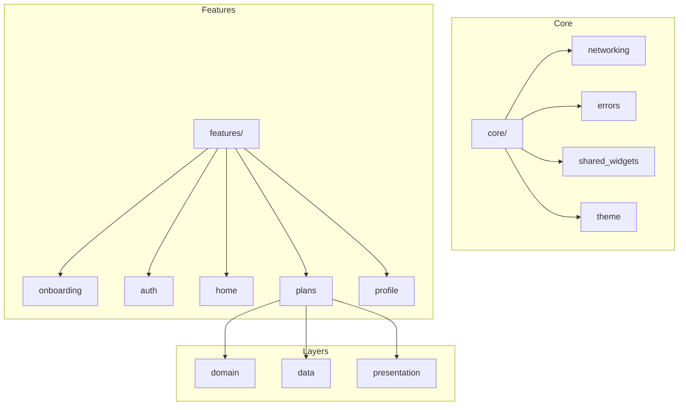

# ⚡ Iron Pulse - Ultimate Fitness Companion
--------------------------------------------

<p align="center">
 
</p>

## 🏋️‍♂️ Unleash Your Potential with Iron Pulse ! 🔥✨
Iron Pulse is your all-in-one fitness ecosystem designed to push your limits. Whether you're a beginner or a pro athlete, Iron Pulse provides the tools you need to track your progress, follow expertly crafted workout plans, and connect with top-tier trainers. 🏃‍♂️💨 From personalized training programs 📋 to real-time performance tracking 📊, we've got everything you need to transform your body and mind! 🌟

**Key Features:**
- 🎯 **Personalized Plans** — Workout programs tailored to your goals.
- 🧘‍♂️ **Pro Trainers** — Access to expert guidance and specialized routines.
- ⭐️ **Favorites** — Curate your own list of preferred exercises and plans.
- 🌑 **Dark & Light Mode** — Sleek, responsive UI that adapts to your style.
- 🧩 **Clean Architecture** — Built for scalability and rock-solid performance.
- 🚀 **Real-time Sync** — Powered by Supabase for a seamless experience.
- 📱 **Responsive Design** — Pixel-perfect on every screen size.

## ⚫️ App Screens In Dark mode:

<!-- TO THE USER: Replace the 'src' in the table below with your Dark Mode screenshots after uploading them to GitHub -->

<table>
<tr>
  <td> </td>
  <td></td>
  <td></td>
  <td></td>
</tr>
<tr>
  <td>Splash Screen</td>
  <td>Onboarding 1</td>
  <td>Onboarding 2</td>
  <td>Onboarding 3</td>
</tr>

<tr>
  <td></td>
  <td></td>
  <td></td>
  <td></td>
</tr>
<tr>
  <td>Login Screen</td>
  <td>Home Screen</td>
  <td>Workout Plans</td>
  <td>Expert Trainers</td>
</tr>

<tr>
  <td></td>
  <td></td>
  <td></td>
  <td></td>
</tr>
<tr>
  <td>Plan Details</td>
  <td>Favorites</td>
  <td>Profile</td>
  <td>Settings</td>
</tr>
</table>

---

## ⚪️ App Screens In Light mode:

<!-- TO THE USER: Replace the 'src' in the table below with your Light Mode screenshots after uploading them to GitHub -->

<table>
<tr>
  <td> </td>
  <td></td>
  <td></td>
  <td></td>
</tr>
<tr>
  <td>Splash Screen</td>
  <td>Onboarding 1</td>
  <td>Onboarding 2</td>
  <td>Onboarding 3</td>
</tr>

<tr>
  <td></td>
  <td></td>
  <td></td>
  <td></td>
</tr>
<tr>
  <td>Login Screen</td>
  <td>Home Screen</td>
  <td>Workout Plans</td>
  <td>Expert Trainers</td>
</tr>
</table>

# 🏛️ Architecture & Modularization
<p align="center">
  
</p>

## 🏗️ Clean Architecture Principles

Iron Pulse is built with **Clean Architecture**, ensuring a clear separation of concerns, testability, and scalability. The project is divided into feature-based modules, each containing three distinct layers:

*   **`Domain Layer`**: The pure business logic core (Entities, Repositories Interfaces, Use Cases).
*   **`Data Layer`**: Implementation of repositories, handling API calls (Supabase) and local storage.
*   **`Presentation Layer`**: The UI layer using **Cubit** for state management and clean, reusable widgets.

### 🛠️ Tech Stack & Key Libraries

We leverage a modern and robust stack to provide the best user experience:

| Category | Technologies & Libraries |
| :--- | :--- |
| **Core** | Flutter SDK, Dart |
| **State Management** | Flutter Bloc (Cubit) |
| **Backend** | Supabase (Auth, Database, Storage) |
| **Navigation** | Go Router |
| **Architecture** | Clean Architecture, Dartz (Either for Error Handling) |
| **UI Components** | Skeletonizer, Awesome Dialog, Flutter Svg |
| **Tools** | Get It (DI), Cached Network Image, Secure Storage |

---

# 🚀 Getting Started

### 1️⃣ Clone the Repository
```bash
git clone https://github.com/[YOUR_USERNAME]/IronPulse.git
```

### 2️⃣ Environment Setup
Create a `.env` file in the root directory and add your Supabase credentials:
```env
SUPABASE_URL=your_supabase_url
SUPABASE_ANON_KEY=your_supabase_anon_key
```

### 3️⃣ Run the Project
```bash
flutter pub get
flutter run
```

---

# 🧩 Project Structure


# 👥 Lead Contributors
- **[Eslam Hossam](https://github.com/Eslam-Hossam1)** - Lead Developer

<br><br>