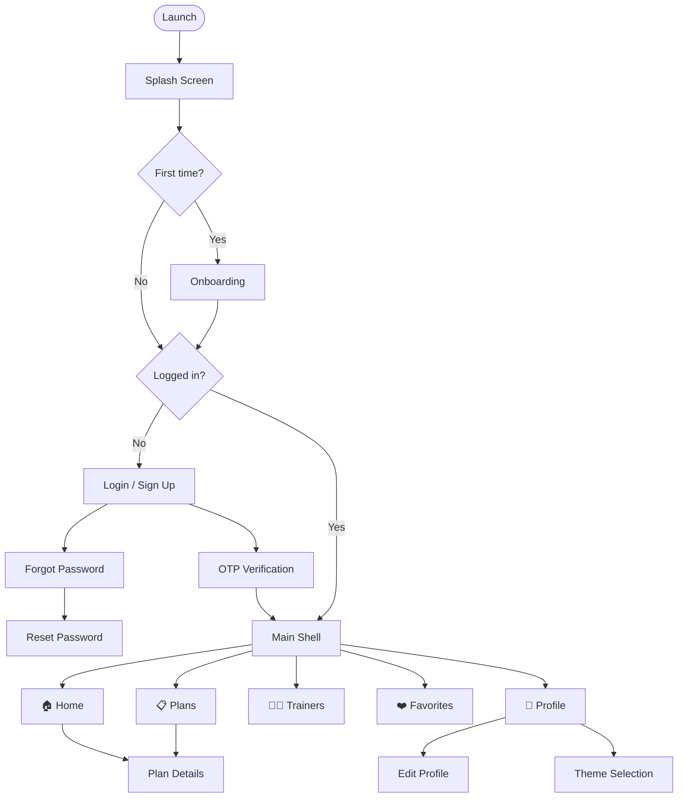

# ⚡ Iron Pulse - Ultimate Fitness Companion
--------------------------------------------

<p align="center">
  
</p>

---

## 🏋️‍♂️ Unleash Your Potential with Iron Pulse ! 🔥✨
Iron Pulse is your all-in-one fitness ecosystem designed to push your limits. Whether you're a beginner or a pro athlete, Iron Pulse provides the tools you need to track your progress, follow expertly crafted workout plans, and connect with top-tier trainers. 🏃‍♂️💨 From personalized training programs 📋 to real-time performance tracking 📊, we've got everything you need to transform your body and mind! 🌟

**Key Features:**
- 🔐 **Auth Flow** — Sign up, log in, OTP verification & password reset.
- 🏠 **Home** — Discover featured plans and quick access to everything.
- 📋 **Plans** — Browse and view detailed workout plans.
- 🧑‍🏫 **Trainers** — Find and connect with professional trainers.
- ❤️ **Favorites** — Save plans you love for quick access.
- 👤 **Profile** — Manage your account and personal information.
- 🌓 **Dark & Light Theme** — Switch between modes instantly.
- 🦴 **Skeleton Loading** — Smooth loading states throughout the app.

---

## ⚫️ App Screens In Dark mode:

<!-- TO THE USER: Replace the 'src' in the table below with your Dark Mode screenshots after uploading them to GitHub -->

<table>
<tr>
  <td></td>
  <td></td>
  <td></td>
  <td></td>
</tr>
<tr>
  <td align="center">Splash Screen</td>
  <td align="center">Onboarding 1</td>
  <td align="center">Onboarding 2</td>
  <td align="center">Onboarding 3</td>
</tr>

<tr>
  <td></td>
  <td></td>
  <td></td>
  <td></td>
</tr>
<tr>
  <td align="center">Login Screen</td>
  <td align="center">Sign Up Screen</td>
  <td align="center">OTP Verification</td>
  <td align="center">Forgot Password</td>
</tr>

<tr>
  <td></td>
  <td></td>
  <td></td>
  <td></td>
</tr>
<tr>
  <td align="center">Home Screen</td>
  <td align="center">Plans Screen</td>
  <td align="center">Plan Details</td>
  <td align="center">Trainers Screen</td>
</tr>

<tr>
  <td></td>
  <td></td>
  <td></td>
  <td></td>
</tr>
<tr>
  <td align="center">Favorites Screen</td>
  <td align="center">Profile Screen</td>
  <td align="center">Edit Profile</td>
  <td align="center">Theme Selection</td>
</tr>
</table>

---

## ⚪️ App Screens In Light mode:

<!-- TO THE USER: Replace the 'src' in the table below with your Light Mode screenshots after uploading them to GitHub -->

<table>
<tr>
  <td></td>
  <td></td>
  <td></td>
  <td></td>
</tr>
<tr>
  <td align="center">Splash Screen</td>
  <td align="center">Onboarding 1</td>
  <td align="center">Onboarding 2</td>
  <td align="center">Onboarding 3</td>
</tr>

<tr>
  <td></td>
  <td></td>
  <td></td>
  <td></td>
</tr>
<tr>
  <td align="center">Login Screen</td>
  <td align="center">Sign Up Screen</td>
  <td align="center">Home Screen</td>
  <td align="center">Plans Screen</td>
</tr>
</table>

---

# 🏛️ Architecture & Modularization
<p align="center">
  
</p>

Iron Pulse is built following **Clean Architecture** principles with a strict **feature-first** folder structure. Each feature is fully isolated with its own `domain`, `data`, and `presentation` layers.

```
lib/
├── core/
│   ├── networking/
│   ├── errors/
│   ├── widgets/
│   ├── theme/
│   ├── services/
│   ├── usecases/
│   ├── enums/
│   └── entities/
│
└── features/
    ├── auth/
    ├── home/
    ├── plans/
    ├── trainers/
    ├── favorites/
    └── profile/
```

---

# 🗺️ App Navigation Flow



---

# 🛠️ Tech Stack & Key Libraries

| Category | Technology / Library |
| :--- | :--- |
| **Language** | Dart |
| **Framework** | Flutter |
| **Architecture** | Clean Architecture, Feature-First |
| **State Management** | flutter_bloc (Cubit) |
| **Navigation** | go_router |
| **Backend / BaaS** | Supabase |
| **Dependency Injection** | get_it |
| **Error Handling** | dartz (Either) |
| **Local Storage** | flutter_secure_storage, hydrated_bloc |
| **Image Loading** | cached_network_image |
| **SVG Support** | flutter_svg |
| **Splash Screen** | flutter_native_splash |
| **Skeleton Loading** | skeletonizer |
| **Dialogs** | awesome_dialog |
| **Image Picker** | image_picker |
| **Toast Notifications** | fluttertoast |
| **Env Variables** | flutter_dotenv |
| **State Equality** | equatable |
| **Font** | Lexend |

---

# 🚀 Getting Started

Follow these steps to clone and run the **Iron Pulse** app on your local machine.

### 1️⃣ Clone the Repository
```bash
git clone https://github.com/Eslam-Hossam1/fitness_app.git
```

### 2️⃣ 🔐 Configure Environment Variables
Create a `.env` file at the project root with the following variables:
```env
SUPABASE_URL=your_supabase_project_url
SUPABASE_ANON_KEY=your_supabase_anon_key
```

### 3️⃣ Install & Run
```bash
flutter pub get
dart run flutter_native_splash:create
flutter run
```

---

# 👥 Lead Contributors
- **[Eslam Hossam](https://github.com/Eslam-Hossam1)** - Lead Developer

---

<p align="center">Made with ❤️ and Flutter 💙</p>